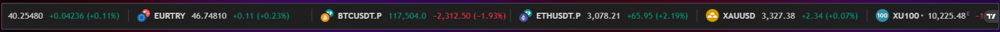
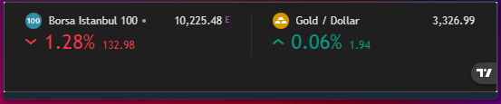
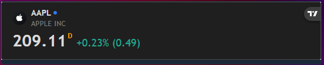
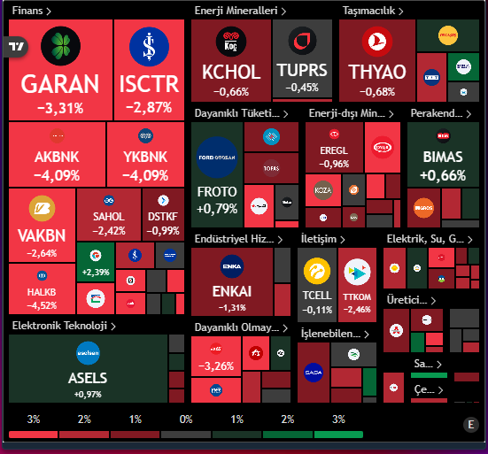
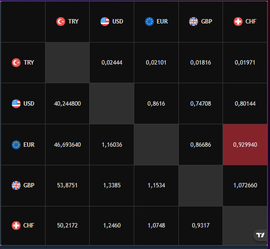

# TradingView Widget Card for Home Assistant

This custom card allows you to embed five different, fully configurable TradingView widgets into your Home Assistant dashboards. With a single card file, you can display market data in a variety of formats.

## ✨ Features

* **Five Widget Types in One:**
    * `Ticker Tape` (Scrolling horizontal bar)
    * `Tickers` (Vertical list of symbols)
    * `Single Quote` (Detailed view of one symbol)
    * `Stock Heatmap` (Market-wide sector visualization)
    * `Forex Cross Rates` (Currency matrix)
* **Highly Customizable:** Easily configure color themes, language, dimensions, and widget-specific settings via YAML for each widget type.
* **Easy Installation:** Install with a single click via the Home Assistant Community Store (HACS).

## 🛠️ Installation

### HACS Installation (Recommended)

1.  If you don't have it, install [HACS](https://hacs.xyz/).
2.  Go to HACS > Frontend.
3.  Search for `TradingView Widget Card`, select it, and install.
4.  Clear your browser' or mobile HA app's cache
5.  Ctrl+F5 for browsers

### Manual Installation

1.  Download the `tradingview-widget-card.js` file from the latest release of your project.
2.  Copy the file to your Home Assistant `/www/Tradingview-Widget-Card/tradingview-widget-card.js` directory.
3.  In Home Assistant, go to **Settings > Dashboards**.
4.  Click the three dots in the top right and select **"Resources"**.
5.  Click **"Add Resource"** and enter the following:
    * **URL:** `/local/Tradingview-Widget-Card/tradingview-widget-card.js`
    * **Resource Type:** `JavaScript Module`
6.  Click **"Create"** and claer your browser's cache, refresh your browser via Ctrl+f5.

---

## ⚙️ Configuration Options

### General Options

These options apply to all widget types unless otherwise noted.

| Option | Type | Default | Description |
| :--- | :--- | :--- | :--- |
| `type` | string | **Required** | Must be `custom:tradingview-widget-card`. |
| `widget_type`| string | `ticker-tape`| Specifies the widget to display. See types below. |
| `title` | string | `(none)` | The title displayed at the top of the card. |
| `color_theme`| string | `dark` | Color theme. Can be `dark` or `light`. |
| `locale` | string | `en` | Widget language (`tr`, `en`, `de`, etc.). |
| `is_transparent`| boolean | `false` | If `true`, the widget's background is transparent. |
| `height` | number | (Varies) | The height of the widget in pixels. |

### Widget-Specific Options

#### `Ticker Tape` (Scrolling Tape)

| Option | Type | Default | Description |
| :--- | :--- | :--- | :--- |
| `pairs` | list | **Required** | A list of symbols to display. Can be simple strings (e.g., `BIST:XU100`) or objects for the `tickers` type (e.g., `{ proName: '..', title: '..' }`). |
| `show_logo` | boolean | `true` | Shows the logos next to the symbols. |
| `display_mode` | string | `regular` | **(Ticker Tape only)** Display mode. Currently only `regular` is supported. |

#### `Tickers`

| Option | Type | Default | Description |
| :--- | :--- | :--- | :--- |
| `pairs` | list | **Required** | A list of symbols to display. Can be simple strings (e.g., `BIST:XU100`) or objects for the `tickers` type (e.g., `{ proName: '..', title: '..' }`). |
| `show_logo` | boolean | `true` | Shows the logos next to the symbols. |
| `display_mode` | string | `regular` | **(Ticker Tape only)** Display mode. Currently only `regular` is supported. |


#### `Single Quote`

| Option | Type | Default | Description |
| :--- | :--- | :--- | :--- |
| `pairs` | list | **Required** | A list containing the single symbol to display. Only the first item in the list is used. |


#### `Stock Heatmap`

| Option | Type | Default | Description |
| :--- | :--- | :--- | :--- |
| `data_source` | string | **Required** | The market to display (e.g., `"S&P 500"`, `"NASDAQ 100"`, `"BIST 100"`). |
| `grouping` | string | `sector` | How to group the symbols (e.g., `"industry"`). |
| `is_zoom_enabled`| boolean | `true` | Enables zooming into the map with the mouse wheel. |
| `has_symbol_tooltip`| boolean| `true` | Shows a detail tooltip when hovering over a symbol. |


#### `Forex Cross Rates`

| Option | Type | Default | Description |
| :--- | :--- | :--- | :--- |
| `currencies` | list | **Required** | A list of currency codes to compare (e.g., `"USD"`, `"EUR"`, `"TRY"`). Must contain at least two. |
| `background_color`| string | `(none)` | Sets a specific background color for the widget using a hex code (e.g., `'#131722'`). |


---

## YAML Examples

Below are comprehensive YAML examples for each widget type, showing all available options.

### 1. Ticker Tape

Displays a horizontally scrolling financial data tape.

```yaml
type: custom:tradingview-widget-card
widget_type: ticker-tape      # (Default: 'ticker-tape')
title: Markets (Scrolling Tape)
height: 46                    # (Default: 46) Height in pixels.
color_theme: dark             # (Default: 'dark') Can be 'dark' or 'light'.
locale: en                    # (Default: 'en') Widget language.
show_logo: true               # (Default: true) Shows symbol logos.
display_mode: regular         # (Default: 'regular') View mode for this widget.
pairs:
  - OANDA:USDTRY
  - OANDA:EURTRY
  - BINANCE:BTCUSDTPERP
  - BIST:XU100
```


### 2. Tickers

Creates a static, vertical list of symbols.

```yaml
type: custom:tradingview-widget-card
widget_type: tickers
title: My Watchlist
height: 250                   # (Default: 75)
color_theme: dark
locale: en
show_logo: true
# For this mode, assigning a custom title to each symbol is best practice.
pairs:
  - proName: BIST:XU100
    title: BORSA ISTANBUL
  - proName: SAXO:XAUUSD
    title: GOLD / USD
```


### 3. Single Quote

Shows a detailed summary of the *first* symbol in the `pairs` list.

```yaml
type: custom:tradingview-widget-card
widget_type: single-quote
title: Apple Inc. (AAPL)
height: 100                   # (Default: 100)
color_theme: dark
locale: en
# ONLY the first symbol in the 'pairs' list is used.
pairs:
  - NASDAQ:AAPL
```


### 4. Stock Heatmap

Visualizes an entire market by sector. This widget does not use the `pairs` list.

```yaml
type: custom:tradingview-widget-card
widget_type: stock-heatmap
title: BIST 100 Sector Heatmap
height: 500                   # (Default: 500)
color_theme: dark
locale: tr
# --- Heatmap Specific Options ---
data_source: BIST100            # (Required) Market to display. e.g., "S&P 500", "NASDAQ 100".
grouping: sector                # (Default: 'sector') How to group symbols. e.g., "industry".
is_zoom_enabled: true           # (Default: true) Enables zooming into the map.
has_symbol_tooltip: true        # (Default: true) Shows symbol details on hover.
```


### 5. Forex Cross Rates

Displays a matrix of exchange rates between selected currencies. This widget does not use the `pairs` list.

```yaml
type: custom:tradingview-widget-card
widget_type: forex-cross-rates
title: Forex Cross Rates
height: 400                   # (Default: 400)
color_theme: dark
locale: en
# --- Cross Rates Specific Options ---
currencies:                   # (Required) At least 2 currency codes.
  - TRY
  - USD
  - EUR
  - GBP
  - CHF
  - JPY
background_color: '#131722'   # (Optional) A specific background color hex code.
```


## ⭐ Support
If you like this card, feel free to ⭐ star the project on GitHub and share it with the Home Assistant community!
