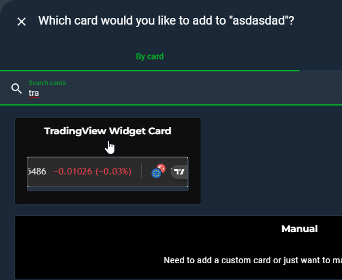
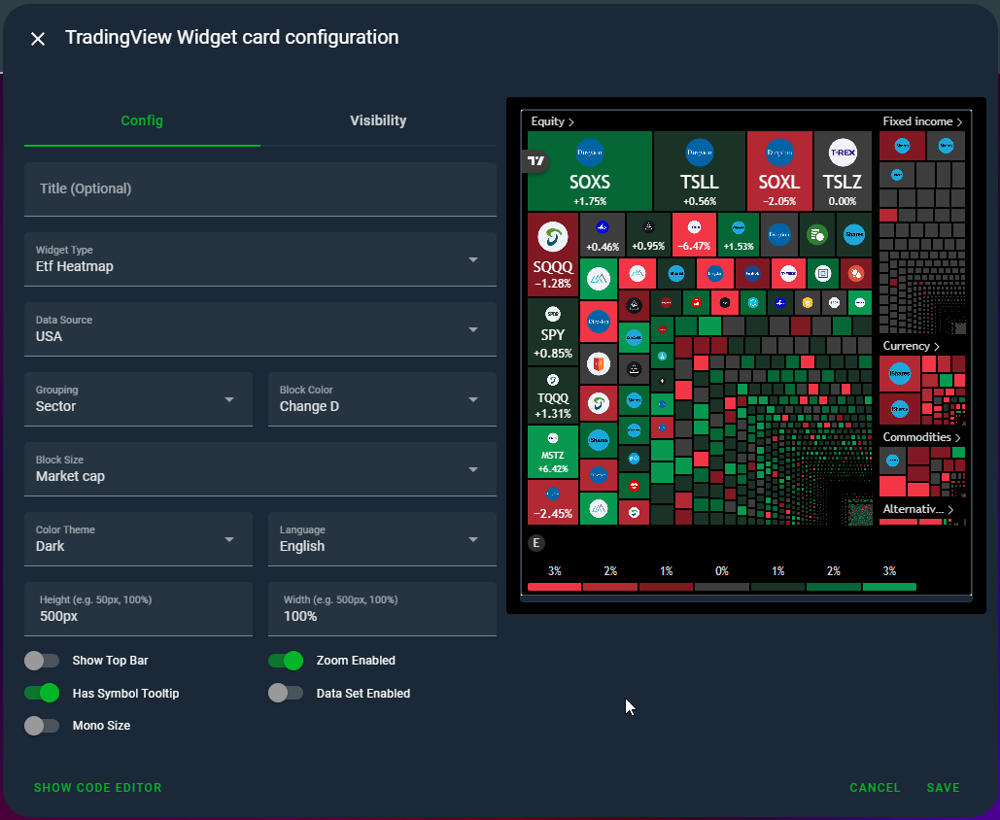

# TradingView Widget Card for Home Assistant

This custom card allows you to embed **ten different**, fully configurable TradingView widgets into your Home Assistant dashboards. With a single card file, you can display market data in a variety of formats.

> ⚠️ This is v2.0 — a complete rewrite. All previous YAML configurations may be no longer compatible. Use the new **visual editor** to recreate your cards effortlessly!

## ✨ Features

* **Ten Widget Types in One:**

  * `Ticker Tape` (Scrolling horizontal bar)
  * `Tickers` (Vertical list of symbols)
  * `Single Quote` (Detailed view of one symbol)
  * `Stock Heatmap` (Market-wide sector visualization)
  * `Forex Cross Rates` (Currency matrix)
  * `Technical Analysis` (Candlestick + indicators)
  * `News` (Finance-focused news ticker)
  * `ETF Heatmap` (Exchange-traded funds by region)
  * `Forex Heat Map` (Currency pair strength map)
  * `Economic Calendar` (Macro data releases)
* **Fully Visual Configuration:** Configure your cards easily with a visual editor (no YAML needed!)
* **Highly Customizable:** Control display mode, theme, symbols, sizing (px or %), languages, filters, and more.
* **Multi-language Support:** Over 20 languages supported including English, Turkish, German, French, etc.
* **Easy Installation:** Install with a single click via the Home Assistant Community Store (HACS).

## 🛠️ Installation

### HACS Installation (Recommended)

1. If you don't have it, install [HACS](https://hacs.xyz/).
2. Go to HACS > Frontend.
3. Search for `TradingView Widget Card`, select it, and install.
4. Clear your browser or mobile HA app cache.
5. Ctrl+F5 for browsers.

### Manual Installation

1. Download the `tradingview-widget-card.js` file from the latest release.
2. Copy the file to your Home Assistant `/www/Tradingview-Widget-Card/` directory.
3. In Home Assistant, go to **Settings > Dashboards**.
4. Click the three dots in the top right and select **"Resources"**.
5. Click **"Add Resource"** and enter:

   * **URL:** `/local/Tradingview-Widget-Card/tradingview-widget-card.js`
   * **Resource Type:** `JavaScript Module`
6. Click **"Create"**, clear your browser's cache, and refresh with Ctrl+F5.

---

## 🚀 What's New in v2.0?

| Feature               | Old Version (v1.x)                                                   | NEW VERSION (v2.0)                                                                           |
| --------------------- | -------------------------------------------------------------------- | -------------------------------------------------------------------------------------------- |
| **Widget Count**      | 5                                                                    | 10                                                                                           |
| **Supported Widgets** | Ticker Tape, Tickers, Single Quote, Stock Heatmap, Forex Cross Rates | ✅ + Technical Analysis<br>✅ News<br>✅ ETF Heatmap<br>✅ Forex Heat Map<br>✅ Economic Calendar |
| **Configuration**     | Manual YAML Only                                                     | ✅ Visual Editor + YAML                                                                       |
| **Customization**     | Basic                                                                | ✅ Advanced Block Size / Feed Filter / Display Modes                                          |
| **Language Support**  | ❌                                                                    | ✅ 20+ languages                                                                              |
| **Sizing**            | Pixels (`px`) only                                                   | ✅ Pixels + Percent (`%`)                                                                     |
| **Ease of Use**       | 😓                                                                   | 😍                                                                                           |

---

## ⚠️ Migration Notice

> Your existing YAML-based configurations from v1.x may not work with v2.0. The structure and logic have changed entirely.

However, thanks to the new **visual editor**, you can easily recreate your old setups **without writing a single line of YAML**. Use the visual UI to pick widget type, options, tickers, colors, dimensions, and more.

---

## ⚙️ Configuration Options
Add your card via Card Picker of Home Assistant



## Fully Visual Configuration
Please refer to the **visual editor** for most configuration. Manual YAML is still supported for advanced users. For YAML usage examples, see the section below.



> Note: New widgets like `technical-analysis`, `news`, `etf-heatmap`, `forex-heat-map`, and `economic-calendar` support **additional filtering**, **display modes**, and **data source configuration**, which will be detailed in the updated docs soon.

---

## 📘 YAML Examples
Check the documentation or visual editor for the latest syntax.

### Ticker Tape

```yaml
- type: custom:tradingview-widget-card
  widget_type: ticker-tape
  title: Piyasa Şeridi
  pairs:
    - OANDA:USDTRY
    - OANDA:EURTRY
    - BINANCE:BTCUSDTPERP
    - BIST:XU100
  show_symbol_logo: true
  display_mode: regular # regular, adaptive, compact
  is_transparent: false
  height: 50px
  width: 100%
  color_theme: dark # dark, light
  locale: tr
```

### Tickers
```yaml
- type: custom:tradingview-widget-card
  widget_type: tickers
  title: Popüler Hisseler
  pairs:
    - NASDAQ:AAPL
    - NASDAQ:GOOGL
    - NASDAQ:MSFT
  show_symbol_logo: true
  height: 75px
  width: 100%
  color_theme: light
  locale: en
  is_transparent: false
```

### Single Quote
```yaml
- type: custom:tradingview-widget-card
  widget_type: single-quote
  title: USD/TRY Paritesi
  pairs:
    - OANDA:USDTRY
  is_transparent: false
  height: 100px
  width: 100%
  color_theme: dark
  locale: tr
```

### Stock Heatmap

```yaml
- type: custom:tradingview-widget-card
  widget_type: stock-heatmap
  title: ABD Hisse Senedi Isı Haritası
  data_source: SPX500 # Örneğin SPX500, NASDAQ, DowJones
  height: 500px
  width: 100%
  exchange: ""
  grouping: sector
  block_size: market_cap_basic
  block_color: change
  has_top_bar: false
  is_zoom_enabled: true
  has_symbol_tooltip: true
  is_data_set_enabled: false
  is_mono_size: true
  color_theme: dark
  locale: en
```

### ETF Heatmap
```yaml
- type: custom:tradingview-widget-card
  widget_type: etf-heatmap
  title: Küresel ETF Isı Haritası
  data_source: AllUSEtf # AllUSEtf, AllAUEtf, vb.
  height: 500px
  grouping: asset_class # asset_class, no_group
  block_size: volume # volume, Value.Traded, monoSize
  block_color: change # change, Perf.W, Perf.1M, vb.
  has_top_bar: false
  is_zoom_enabled: true
  has_symbol_tooltip: true
  is_data_set_enabled: false
  is_mono_size: false
  locale: en
  color_theme: dark
  width: 100%
```
### Forex Cross Rates

```yaml
- type: custom:tradingview-widget-card
  widget_type: forex-cross-rates
  title: Döviz Çapraz Kurları
  currencies:
    - EUR
    - USD
    - GBP
    - JPY
    - CHF
    - CAD
    - TRY
  color_theme: dark
  locale: en
  background_color: "#000000"
  width: 100%
  height: 500px
```

### Forex Heatmap
```yaml
- type: custom:tradingview-widget-card
  widget_type: forex-heat-map
  title: Döviz Isı Haritası
  currencies:
    - EUR
    - USD
    - JPY
    - GBP
    - CHF
    - AUD
    - CAD
  color_theme: dark
  locale: en
  is_transparent: false
  background_color: "#000000"
  width: 100%
  height: 300px
```

### Technical Analysis
```yaml
- type: custom:tradingview-widget-card
  widget_type: technical-analysis
  title: BTC/USDT Teknik Analiz
  pairs:
    - BINANCE:BTCUSDT
  interval: 1D # 1m, 5m, 15m, 1H, 4H, 1D, 1W, 1M
  height: 100%
  width: 100%
  show_interval_tabs: true
  is_transparent: false
  display_mode: single
  locale: en
  color_theme: dark
```
### Economic Calendar
```yaml
- type: custom:tradingview-widget-card
  widget_type: economic-calendar
  title: Ekonomik Takvim
  height: 450px
  country_filter: us,eu,tr
  importance_filter: -1,0,1
  color_theme: dark
  locale: en
  width: 100%
  is_transparent: false
```

### News
```yaml
- type: custom:tradingview-widget-card
  widget_type: news
  title: Piyasa Haberleri
  display_mode: adaptive # adaptive, regular, compact
  feed_mode: all_symbols # all_symbols, symbol, market
  # feed_mode 'symbol' ise aşağıdaki satırı kullanın:
  # symbol: NASDAQ:AAPL
  # feed_mode 'market' ise aşağıdaki satırı kullanın:
  # market: crypto # crypto, forex, stock, index, futures, cfd
  height: 450px
  color_theme: dark
  locale: en
  width: 100%
  is_transparent: false
```

---

## ⭐ Support

If you like this card, feel free to ⭐ star the project on GitHub and share it with the Home Assistant community!

> We're excited to see the amazing dashboards you'll create with TradingView Widget Card v2.0! 🎉
